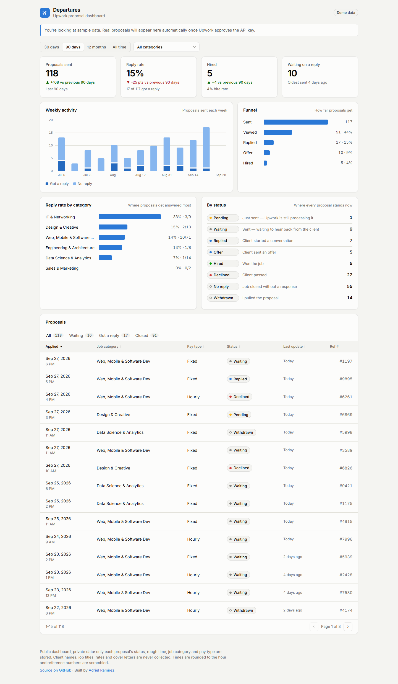

# ✈ Departures

**A dashboard for every Upwork proposal I send: reply rate, funnel, weekly activity, and the status of each proposal.**

**▶ Live dashboard: https://upwork-departures.vercel.app**



Freelancing on Upwork means sending a lot of proposals and not always knowing what's working. This dashboard answers the questions I actually have: How many am I sending? How many get a reply? Which job categories respond best? What's still waiting?

## What's on the dashboard

- **Filters** for date range (30 days, 90 days, 12 months, all time) and job category. Every number, chart, and table row below updates together.
- **Key numbers:** proposals sent, reply rate, hires, and proposals waiting on a reply, each compared with the previous period.
- **Weekly activity:** proposals sent per week, split by whether they got a reply.
- **Funnel:** sent → viewed → replied → offer → hired.
- **Reply rate by category** and a **status breakdown**.
- **Proposals table:** status tabs with counts, sortable columns, and paging. On phones, each proposal becomes a compact card.
- Light and dark mode, keyboard-accessible chart tooltips, and a color palette checked for color-blind safety.

| Status | Upwork status | Meaning |
|---|---|---|
| Pending | `Pending` | Just sent, Upwork is still processing it |
| Waiting | `Accepted` | Sent, waiting to hear back (for freelancers, "Accepted" means Upwork accepted the submission, not the client) |
| Replied | `Activated` | Client started a conversation |
| Offer | `Offered` | Client sent an offer |
| Hired | `Hired` | Won the job |
| Declined | `Declined` | Client passed |
| No reply | `Archived` | Job closed without a response |
| Withdrawn | `Withdrawn` | I pulled the proposal |

## Public board, private data

The board is public; the data behind it isn't.

- The server asks Upwork for **only** status, timestamps, job category, and contract type. Job titles, client names, rates, and cover letters are never even requested.
- Proposal IDs become **reference numbers via a salted HMAC**, so they're stable but can't be traced back to a job.
- Times are **rounded down to the hour**.
- Upwork OAuth tokens and the sanitized snapshot live in a **private Vercel Blob store**. The browser only ever receives the sanitized snapshot.
- The connect and sync endpoints are locked behind secrets and return `404` to everyone else.

The privacy filter is covered by tests (`tests/sanitize.test.ts`).

## How it works

```
Vercel Cron (daily) ──► /api/sync ──► Upwork GraphQL (vendorProposals)
                                            │
                                   lib/sanitize.ts (strip + scramble)
                                            │
                                   private Blob: snapshot.json ──► / (the board)
```

- **Next.js 16** (App Router, TypeScript), hand-written CSS and SVG charts (no chart library)
- **Upwork GraphQL API** with OAuth 2.0 (authorization code + refresh tokens)
- **Vercel Blob** (private) for tokens and snapshots, **Vercel Cron** for daily syncs
- **Vitest** for the privacy and stats logic

Until the Upwork API key is approved, the board shows clearly labelled **demo data** generated by `lib/demo.ts`.

## Running locally

```bash
npm install
npm run dev     # shows demo data with no setup
npm test
```

## Connecting Upwork

1. Apply for an API key at the [Upwork Developer Space](https://www.upwork.com/developer/keys/apply) with the callback URL `https://<your-domain>/api/callback`.
2. Copy `.env.example` and fill in the values (in Vercel: **Settings → Environment Variables**).
3. Connect a private Blob store to the Vercel project.
4. Visit `https://<your-domain>/api/connect?key=<ADMIN_KEY>` and approve access on Upwork.

The first sync runs immediately, then daily via Vercel Cron. To sync manually, visit `/api/sync?key=<ADMIN_KEY>`.

## Project structure

```
app/page.tsx            Page shell: header, demo notice, footer
components/Dashboard    Filters, KPI tiles, and the chart grid
components/charts       Weekly column chart, bar lists, KPI tile, tooltips
components/ProposalsTable  Status tabs, sorting, paging
app/api/connect         Starts Upwork OAuth (owner only)
app/api/callback        Saves tokens, runs the first sync
app/api/sync            Daily sync (Vercel Cron) or manual with ?key=
lib/upwork.ts           OAuth + GraphQL client
lib/sanitize.ts         The privacy filter
lib/stats.ts            Rates, funnel, weekly activity, status counts
```
